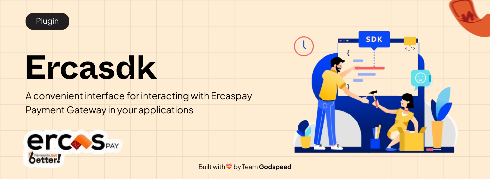

**Ercaspay JavaScript SDK**. Built with ❣️ by Team Godspeed

# Table Of Content

- [Table Of Content](#table-of-content)
  - [Introduction 🚀](#introduction-)
    - [Why Did We Build This? 🤔](#why-did-we-build-this-)
    - [Ercaspay Js SDK Features 🚀](#ercaspay-js-sdk-features-)
  - [Installation 💽](#installation-)
  - [Usage 🚦](#usage-)
    - [SDK Typed Response](#sdk-typed-response)
    - [ErcaspayCheckout Class](#ercaspaycheckout-class)
    - [ErcaspayCard Class](#ercaspaycard-class)
    - [Ercaspay Bankransfer Class](#ercaspay-bankransfer-class)
    - [Ercaspay USSD Class](#ercaspay-ussd-class)
    - [Ercaspay Transaction Class](#ercaspay-transaction-class)

## Introduction 🚀

Introducing the **Ercaspay** JavaScript SDK: A Hackathon Innovation in Payment Solutions! 💡🏆

Built during an exciting hackathon sprint, our SDK is crafted on top of the powerful Ercaspay APIs to help developers easily integrate payment solutions into their apps. We’ve designed it to be intuitive, efficient, and super easy to use—no more complex setups or long implementation times. With our SDK, you’ll have everything you need to implement payments smoothly and get back to focusing on what matters most—building amazing products. 🚀

### Why Did We Build This? 🤔

During the hackathon, we saw a common challenge developers face: the complexity of integrating payment gateways. Having worked with payment APIs before, I know how frustrating it can be when there’s no SDK, leaving you to manually test the APIs with tools like Postman just to figure out what responses to expect. And even when an SDK exists, many don’t offer proper typing, making it a guessing game when calling methods or properties.

That’s why we built this SDK—to solve all of these problems. But we didn’t stop there. We went the extra mile to ensure it’s not just functional but robust and easy to use. We battle-tested our **SDK** with over **70** test suites to ensure reliability and performance under real-world conditions. We also added comprehensive documentation to each and every method and property, so users can start integrating right away—without having to read the docs. As you call a method or access a property, you’ll see all the details you need right in your **IDE**, making it easier than ever to integrate Ercaspay into your projects.

### Ercaspay Js SDK Features 🚀

Why should you use the **Ercaspay JS SDK** 🤔 ?

- **Effortless Integration:** The Ercaspay JS SDK streamlines the integration process, allowing users to interact with the Ercaspay Payment APIs without the usual hassle. Gone are the days of testing APIs manually in tools like Postman—we’ve made it as easy as calling a method.

- **Accelerated Development:** With simplified methods, clear type definitions, and enhanced autocompletion, developers can ship their products faster and reduce time-to-market. We’ve taken the guesswork out of the equation, helping you focus more on building and less on debugging.

- **Minimal API Interaction:** Achieve robust payment functionalities with minimal direct interaction with the APIs. Our SDK abstracts away the complexity, so you can integrate payment features without getting bogged down by API details.

- **Typed Responses:** Automatic type definitions for API responses ensure your code is both robust and error-free. Responses are now typed out of the box, giving developers a more structured and predictable development experience.

- **TypeScript / JavaScript Autocompletion:** Whether you're working in TypeScript or JavaScript, our SDK supports autocompletion, making it easier to develop by providing accurate method suggestions and reducing errors. This feature significantly boosts productivity and helps you write more reliable code.

- **Comprehensive JSDoc Support:** Say goodbye to searching for documentation. Our SDK comes with thorough JSDoc support, giving you all the descriptive and actionable information you need right in your IDE, so you can focus on what really matters—building your app.

- **Efficient Error Handling:** Error handling is a breeze with the Ercaspay JS SDK. It provides clear, detailed error messages, making it easier for developers to troubleshoot and resolve issues quickly, ensuring a smoother integration.

These enhancements aim to provide developers with a more powerful, flexible, and enjoyable experience when integrating [Ercaspay Payment APIs](https://ercaspay.com/) into their applications.

## Installation 💽

To install the **SDK** in your application, you can install using `npm, yarn, pnpm or bun`

**Npm**

```bash

npm install ercaspay-sdk

```

**Yarn**

```bash
yarn add ercaspay-sdk

```

**Bun**

```bash
bun add ercaspay-sdk

```

## Usage 🚦

While the Ercaspay JS SDK is designed to be intuitive and easy to use (so you can start integrating without even opening the docs!), I’ll still walk you through each key SDK method to make sure you’re equipped with all the details.

To get started with the Ercaspay JS SDK, you first need to import the ErcaspayClient from the `ercaspay-sdk` package. This class is your gateway to the SDK, providing all the methods you need to interact with the Ercaspay Payment APIs.

```typescript
import { ErcaspayClient } from "ercaspay-sdk";
```

Then we create a new instance of the **ErcaspayClient** which allows us to interact with the the methods in the **ErcaspayClient**. It takes 2 arguments.

1. The Ercaspay Secret Key
2. The Environment. (Optional, defaults to `development`)

The Secret Key can be gotten from the **Ercaspay** website. <https://sandbox.ercaspay.com/sign-up> or <https://merchant.ercaspay.com/sign-up>

```typescript
const ercaspay = new ErcaspayClient(
  process.env.ERCASPAY_SECRET_KEY as string,
  process.env.NODE_ENV as string
);
```

### SDK Typed Response

The **SDK** provides **typed responses** for every method call, ensuring that you get consistent and structured data with every interaction. The base response object contains key information, including the request status, response code, error message or response message (if applicable), and the actual data returned from the API. With clear response data, you can tailor your application’s behavior based on the success or failure of an operation—allowing you to respond appropriately and handle errors efficiently.

```typescript
/**
 * Represents a base response structure for API requests.
 * @template TResponse - The type of the response body.
 */
export interface IBaseResponse<TResponse> {
  /**
   * Indicates whether the request was successful.
   * @type {boolean}
   */
  requestSuccessful: boolean;

  /**
   * A code representing the status of the response (e.g., success, error).
   * @type {string}
   */
  responseCode: string;

  /**
   * A message providing additional details on the response, typically used for errors.
   * @type {string}
   */
  errorMessage?: string;

  /**
   * A message providing additional details on the response, typically used for success response.
   * @type {string}
   */
  responseMessage?: string;

  /**
   * The actual data returned in the response.
   * @type {TResponse}
   */
  responseBody: TResponse;
}
```

Let’s assume you’re initiating a payment using the `checkout.initiateTransaction` method. When you call this method, it returns a typed response that you can directly assign to a variable. This response includes crucial details, such as the success status, response message, and any additional data returned by the API.

```typescript
import { ErcaspayClient } from "ercaspay-sdk";

const ercaspay = new ErcaspayClient(
  process.env.ERCASPAY_SECRET_KEY as string,
  process.env.NODE_ENV as string
);

const response = await ercaspay.checkout.initiateTransaction({
  amount: 10000,
  paymentReference: "R5md7gd9b4s3h2j5d67g",
  paymentMethods: "card,bank-transfer,ussd,qrcode",
  customerName: "Adedoyin Emmanuel",
  customerEmail: "hi@adedoyinemmanuel.dev",
  customerPhoneNumber: "09061626364",
  redirectUrl: "https://github.com/adedoyin-emmanuel",
  description: "Lorem ipsum dolor sit amet, consectetur adipiscing elit",
  currency: "NGN",
  feeBearer: "customer",
  metadata: {
    firstname: "Temi",
    lastname: "Girl",
    email: "temigirl@mail.com",
  },
});

// check if the response was successful, if not, return a response to the client.

if (!response.requestSuccessful)
  return res.status(response.status).json({ message: response.message });

// Response was successful, I can now get the checkout_url

const checkoutUrl = response.responseBody.checkoutUrl;

// redirect the client to the checkout_url

res.redirect(checkoutUrl); // assuming you are using express JS
```

### ErcaspayCheckout Class

The `ErcaspayCheckout` class is part of the Ercaspay JS SDK and provides methods to handle transactions related to the ErcasPay Checkout platform. It allows you to initiate a transaction and verify the status of a transaction using its reference.

**Methods**

1. `initiateTransaction`: Initiates a checkout transaction on the ErcasPay platform. The method first validates the input data using a predefined schema, and then it sends a request to initiate the transaction.

**Example**

```typescript
const response = await ercaspay.checkout.initiateTransaction({
  amount: 10000,
  paymentReference: "R5md7gd9b4s3h2j5d67g",
  paymentMethods: "card,bank-transfer,ussd,qrcode",
  customerName: "Adedoyin Emmanuel",
  customerEmail: "hi@adedoyinemmanuel.dev",
  customerPhoneNumber: "09061626364",
  redirectUrl: "https://github.com/adedoyin-emmanuel",
  description: "Lorem ipsum dolor sit amet, consectetur adipiscing elit",
  currency: "NGN",
  feeBearer: "customer",
  metadata: {
    firstname: "Temi",
    lastname: "Girl",
    email: "temigirl@mail.com",
  },
});
```

As you know, the SDK comes with `Typed Responses` which means automatic type definitions for API responses. Below is an example of what the `initiateTransaction` method returns.

```typescript
/**
 * The unique payment reference.
 * @type {string}
 */
paymentReference: string;

/**
 * A unique transaction reference.
 * @type {string}
 */
transactionReference: string;

/**
 * The URL to complete the checkout process.
 * @type {string}
 */
checkoutUrl: string;
```

2. `verifyTransaction`: Verifies the status of a checkout transaction using its unique reference. This is useful for checking if a transaction has been successfully completed.

**Example**

```typescript
const validTransactionRef = "ERCS|20241214214035|1734208835283";

const response = await ercaspay.checkout.verifyTransaction(validTransactionRef);
```

**Typed Response**

```typescript
/**
 * Represents the response structure for verifying a checkout transaction.
 */
export interface IVerifyCheckoutTransactionResponse {
  /**
   * The domain where the transaction was processed.
   * @type {string}
   */
  domain: string;

  /**
   * The status of the transaction (e.g., success, failed).
   * @type {string}
   */
  status: string;

  /**
   * The ERCs reference associated with the transaction.
   * @type {string}
   */
  ercs_reference: string;

  /**
   * The unique transaction reference.
   * @type {string}
   */
  tx_reference: string;

  /**
   * The amount for the transaction.
   * @type {number}
   */
  amount: number;

  /**
   * A description of the transaction.
   * @type {string}
   */
  description: string;

  /**
   * The timestamp when the payment was made.
   * @type {string}
   */
  paid_at: string;

  /**
   * The timestamp when the transaction was created.
   * @type {string}
   */
  created_at: string;

  /**
   * The payment channel used for the transaction.
   * @type {string}
   */
  channel: string;

  /**
   * The currency in which the transaction was processed.
   * @type {string}
   */
  currency: string;

  /**
   * Additional metadata related to the transaction (optional).
   * @type {Record<string, any> | undefined}
   */
  metadata?: Record<string, any>;

  /**
   * The fee charged for processing the transaction.
   * @type {number}
   */
  fee: number;

  /**
   * Specifies who bears the transaction fee ("customer" or "merchant").
   * @type {string}
   */
  fee_bearer: string;

  /**
   * The amount that was actually settled for the transaction.
   * @type {number}
   */
  settled_amount: number;

  /**
   * Information about the customer involved in the transaction.
   * @type {ICustomer}
   */
  customer: ICustomer;
}

/**
 * Represents the details of a customer.
 */
export interface ICustomer {
  /**
   * The name of the customer.
   * @type {string}
   */
  name: string;

  /**
   * The email address of the customer.
   * @type {string}
   */
  email: string;

  /**
   * The phone number of the customer (optional).
   * @type {string | undefined}
   */
  phone_number?: string;

  /**
   * A unique reference identifier for the customer.
   * @type {string}
   */
  reference: string;
}
```

### ErcaspayCard Class

This class handles card-related payment flows for the Ercaspay system. It supports initiating payments, submitting and resending OTPs, retrieving transaction details, and verifying transactions.

**Methods**

1. `initiatePayment`: Initiates a card payment transaction. Depending on the type of card, the response may include a link to a 3D authentication page or a notification that an OTP has been sent to the registered phone number.

```typescript
const paymentData = {
  payload: "encrypted_card_details",
  transactionReference: "unique_transaction_reference",
  deviceDetails: {
    payerDeviceDto: {
      device: {
        browser: "Chrome",
        browserDetails: {
          "3DSecureChallengeWindowSize": "800x600",
          acceptHeaders: "application/json",
          colorDepth: 24,
          javaEnabled: true,
          language: "en-US",
          screenHeight: 1080,
          screenWidth: 1920,
          timeZone: -180,
        },
      },
    },
  },
};

const response = await ercaspay.card.initiatePayment(paymentData);
```

**Typed Response**

```typescript
/**
 * Represents the response structure for a card transaction.
 */
export interface ICardResponse {
  /**
   * A code representing the status of the transaction.
   * @type {string}
   */
  code: string;

  /**
   * The status of the transaction (e.g., success, failed).
   * @type {string}
   */
  status: string;

  /**
   * A message from the gateway providing details about the transaction status.
   * @type {string}
   */
  gatewayMessage: string;

  /**
   * A support message providing additional assistance or instructions (optional).
   * @type {string | undefined}
   */
  supportMessage?: string;

  /**
   * A unique reference for the transaction.
   * @type {string}
   */
  transactionReference: string;

  /**
   * A unique payment reference.
   * @type {string}
   */
  paymentReference: string;

  /**
   * The amount of money involved in the transaction.
   * @type {number}
   */
  amount: number;

  /**
   * The URL to redirect to for completing the transaction.
   * @type {string}
   */
  redirectUrl: string;

  /**
   * A unique reference from the gateway (optional).
   * @type {string | undefined}
   */
  gatewayReference?: string;

  /**
   * The ECI flag for the transaction (optional).
   * @type {string | undefined}
   */
  eciFlag?: string;

  /**
   * The authentication code for the transaction (optional).
   * @type {string | undefined}
   */
  transactionAuth?: string;

  /**
   * The transaction ID (optional).
   * @type {string | undefined}
   */
  transactionId?: string;

  /**
   * A link to authenticate the transaction (optional).
   * @type {string | undefined}
   */
  transactionAuthLink?: string;
}
```

2. `submitOTP`: Submits an OTP for card validation. If the OTP is valid, the transaction is processed by the customer's payment institution.

**Example**

```typescript
const otpData = {
  otp: "123456",
  gatewayReference: "gateway_reference",
  transactionReference: "transaction_reference",
};

const response = await ercarspay.card.submitOTP(otpData);
```

**Typed Response**

```typescript
/**
 * Represents the response structure after submitting an OTP for a transaction.
 */
export interface ISubmitOTPResponse {
  /**
   * The status of the OTP submission.
   * @type {string}
   */
  status: string;

  /**
   * A message from the gateway providing additional details.
   * @type {string}
   */
  gatewayMessage: string;

  /**
   * A unique reference for the transaction.
   * @type {string}
   */
  transactionReference: string;

  /**
   * A unique payment reference.
   * @type {string}
   */
  paymentReference: string;

  /**
   * The amount involved in the transaction.
   * @type {number}
   */
  amount: number;

  /**
   * The URL to call back after submitting the OTP.
   * @type {string}
   */
  callbackUrl: string;
}
```

3. `resendOTP`: Resends an OTP for card validation. Useful if the user did not receive the OTP or it expired.

**Example**

```typescript
const resendOTPData = {
  transactionReference: "transaction_reference",
  gatewayReference: "gateway_reference",
};

const response = await ercaspay.card.resendOTP(resendOTPData);
```

**Typed Response**

```typescript
/**
 * Represents the response structure after resending an OTP.
 */
export interface IResendOTPResponse
  extends Omit<ISubmitOTPResponse, "amount" | "callbackUrl"> {}
```

4. `getDetails`: Retrieves the details of a card transaction. Useful for transaction monitoring, reconciliation, and auditing.

**Example**

```typescript
const transactionReference = "transaction_reference";
const response = await ercaspay.card.getDetails(transactionReference);
```

**Typed Response**

```typescript
export interface IGetCardDetailsResponse {
  /**
   * The amount involved in the transaction.
   * @type {number}
   */
  amount: number;

  /**
   * A unique reference for the transaction.
   * @type {string}
   */
  reference: string;

  /**
   * The currency in which the transaction is processed.
   * @type {string}
   */
  currency: string;
}
```

5. `verifyTransaction`: Verifies the validity of a card transaction. Confirms whether the transaction is authentic and can proceed further.

**Example**

```typescript
const transactionReference = "transaction_reference";
const response = await ercaspay.card.verifyTransaction(transactionReference);
```

**Typed Response**

```typescript
/**
 * Represents the response structure for verifying a card transaction.
 */
export interface IVerifyCardTransactionResponse {}
```

### Ercaspay Bankransfer Class

The `ErcaspayBankTransfer` class is part of the Ercaspay SDK and handles the initiation of bank transfer payment flows. This class extends from the base ErcaspayBase class and provides functionality to interact with bank transfer payment-related API endpoints.

**Methods**

1. `initializeTransfer(transactionReference: string)`: Initializes a bank transfer transaction by requesting the necessary details for a specific transaction reference. The method checks if the provided reference is valid, then makes an API request to retrieve the bank account details and status for the transaction.

**Example**

```typescript
const transactionReference = "ERCS|20241216175111|1734367871284";

const response = await ercaspay.bankTransfer.initializeTransfer(
  transactionReference
);
```

**Typed Response**

```typescript
/**
 * Represents the response structure after initializing a transfer.
 */
export interface IIntitializeTransferResponse {
  /**
   * The status of the transfer (e.g., success, failed).
   * @type {string}
   */
  status: string;

  /**
   * A message from the gateway providing additional details about the transfer status.
   * @type {string}
   */
  gatewayMessage: string;

  /**
   * A unique reference for the transaction.
   * @type {string}
   */
  transactionReference: string;

  /**
   * The amount of money to be transferred.
   * @type {number}
   */
  amount: number;

  /**
   * The account number to which the transfer will be made.
   * @type {string}
   */
  accountNumber: string;

  /**
   * The email address associated with the account receiving the transfer.
   * @type {string}
   */
  accountEmail: string;

  /**
   * The name of the account holder receiving the transfer.
   * @type {string}
   */
  accountName: string;

  /**
   * A unique reference for the account involved in the transfer.
   * @type {string}
   */
  accountReference: string;

  /**
   * The name of the bank handling the transfer.
   * @type {string}
   */
  bankName: string;

  /**
   * The time in seconds until the transfer expires.
   * @type {number}
   */
  expires_in: number;
}
```

### Ercaspay USSD Class

The ErcaspayUSSD class is part of the Ercaspay SDK and provides methods for initiating USSD codes, fetching a list of supported banks, and canceling USSD transactions.

**Methods**

1. `initiateCode(data)`: Initiates a USSD code for a specific transaction reference. The method requires transaction details such as the transaction reference and bank name to be sent as part of the request. The input data is validated, and if successful, a USSD code is returned for completing the transaction.

**Example**

```typescript
const transactionRef = "ERCS|20230418155255|1681833175587831";
const response = await ercaspay.ussd.initiateCode({
  bankName: "gtbank",
  transactionReference: transactionRef,
});
```

**Typed Response**

```typescript
/**
 * Represents the response structure for initiating a code for a transaction.
 */
export interface IInitiateCodeResponse {
  /**
   * The status of the initiation request (e.g., success, failure).
   * @type {string}
   */
  status: string;

  /**
   * The message provided by the gateway regarding the transaction initiation.
   * @type {string}
   */
  gatewayMessage: string;

  /**
   * The unique transaction reference associated with the initiation.
   * @type {string}
   */
  transactionReference: string;

  /**
   * A unique reference provided by the gateway for tracking the transaction.
   * @type {string}
   */
  gatewayReference: string;

  /**
   * The USSD code used for the transaction.
   * @type {string}
   */
  ussdCode: string;

  /**
   * The payment code used for the transaction.
   * @type {string}
   */
  paymentCode: string;

  /**
   * The amount of money involved in the transaction.
   * @type {number}
   */
  amount: number;

  /**
   * The time in seconds until the code expires.
   * @type {number}
   */
  expires_in: number;
}
```

2. `getBankList()`: Fetches the list of supported banks for USSD transactions. This method retrieves the banks that are available for initiating USSD transactions via the Ercaspay system.

**Example**

```typescript
const response = await ercaspay.ussd.getBankList();
```

**Typed Response**

```typescript
[
  "access",
  "alat",
  "ecobank",
  "FCMB",
  "fidelity",
  "firstbank",
  "gtbank",
  "heritage",
  "keystone",
  "polaris",
  "stanbic",
  "sterling",
  "uba",
  "union",
  "unity",
  "wema",
  "zenith",
];
```

### Ercaspay Transaction Class

This class provides methods to interact with the transaction-related endpoints in the Ercaspay system. It includes methods to fetch transaction details, verify transactions, check transaction status, cancel transactions, and initiate new transactions.

**Methods**

1. `getDetails(transactionReference)`: Retrieve the details of a specific transaction using its unique reference.

**Example**

```typescript
const transactionRef = "ERCS|20231113082706|1699860426792";
const response = await ercaspay.transaction.getDetails(transactionRef);
```

**Typed Response**

```typescript
/**
 * Represents the response structure for fetching transaction details.
 */
export interface IGetTransactionDetailsResponse {
  /**
   * The name of the customer involved in the transaction.
   * @type {string}
   */
  customerName: string;

  /**
   * The email address of the customer involved in the transaction.
   * @type {string}
   */
  customerEmail: string;

  /**
   * The amount of money involved in the transaction.
   * @type {number}
   */
  amount: number;

  /**
   * The business name associated with the transaction.
   * @type {string}
   */
  businessName: string;

  /**
   * The business logo associated with the transaction.
   * @type {string}
   */
  businessLogo: string;

  /**
   * The white-label configuration associated with the transaction.
   * @type {IWhiteLabel}
   */
  whiteLabel: IWhiteLabel;

  /**
   * The payment methods available for the transaction.
   * @type {string[]}
   */
  paymentMethods: string[];
}
```

2. `verify(transactionReference)`: Verifies the status of a specific transaction using its unique reference.

**Example**

```typescript
const validTransactionRef = "ERCS|20241216085942|1734335982170";
const response = await ercaspay.transaction.verify(validTransactionRef);
```

**Typed Response**

```typescript
/**
 * Represents the response structure for verifying a transaction.
 */
export interface IVerifyTransactionResponse
  extends IVerifyCheckoutTransactionResponse {}
```

3. `getStatus(data)`: Fetches the status of a transaction using the provided data (payment method and transaction reference).

**Example**

```typescript
const validTransactionRef = "ERCS|20241215043712|1734233832822";

const response = await ercaspay.transaction.getStatus({
  transactionReference: validTransactionRef,
  paymentMethod: "card",
  reference: "P1vpu4GwRb3i1MP",
});
```

**Typed Response**

```typescript
/**
 * Represents the response structure for fetching the status of a transaction.
 */
export interface IGetTransactionStatusResponse {
  /**
   * A unique payment reference for the transaction.
   * @type {string}
   */
  paymentReference: string;

  /**
   * The amount of money involved in the transaction.
   * @type {number}
   */
  amount: number;

  /**
   * The status of the transaction (e.g., pending, completed).
   * @type {string}
   */
  status: string;

  /**
   * A description of the transaction status.
   * @type {string}
   */
  description: string;

  /**
   * The URL to call back after the transaction status is fetched.
   * @type {string}
   */
  callbackUrl: string;
}
```

4. `cancel(transactionReference)`: Cancels a specific transaction using its reference.

**Example**

```typescript
const transactionRef = "ERCS|20241215043712|1734233832822";

const response = await client.transaction.cancel(transactionRef);
```

**Typed Response**

```typescript
/**
 * Represents the response structure for canceling a transaction.
 */
export interface ICancelTransactionResponse {
  /**
   * The URL to call back after canceling the transaction.
   * @type {string}
   */
  callback_url: string;
}
```

5. `initiate(data)`: Initiates a new transaction with the given data.

**Example**

```typescript
const response = await ercaspay.transaction.initiate({
  amount: 10000,
  paymentReference: "R5md7gd9b4s3h2j5d67g",
  paymentMethods: "card,bank-transfer,ussd,qrcode",
  customerName: "Adedoyin Emmanuel",
  customerEmail: "hi@adedoyinemmanuel.dev",
  customerPhoneNumber: "09061626364",
  redirectUrl: "https://github.com/adedoyin-emmanuel",
  description: "Lorem ipsum dolor sit amet, consectetur adipiscing elit",
  currency: "NGN",
  feeBearer: "customer",
  metadata: {
    firstname: "Temi",
    lastname: "Girl",
    email: "temigirl@mail.com",
  },
});
```

**Typed Response**

```typescript
/**
 * Represents the response structure after initiating a transaction.
 */
export interface IInitiateTransactionResponse {
  /**
   * A unique payment reference for the transaction.
   * @type {string}
   */
  paymentReference: string;

  /**
   * A unique transaction reference for the initiated transaction.
   * @type {string}
   */
  transactionReference: string;

  /**
   * A URL to the checkout page for the transaction.
   * @type {string}
   */
  checkoutUrl: string;

  /**
   * The white-label configuration associated with the transaction.
   * @type {IWhiteLabel}
   */
  whiteLabel: IWhiteLabel;
}

/**
 * Represents the white-label configuration for the transaction system.
 */
export interface IWhiteLabel {
  /**
   * The unique identifier for the white-label configuration.
   * @type {number}
   */
  id: number;

  /**
   * The URL of the logo to be displayed for the white-label brand.
   * @type {string}
   */
  logo_url: string;

  /**
   * The primary color associated with the white-label branding.
   * @type {string}
   */
  primary_color: string;

  /**
   * The accent color associated with the white-label branding.
   * @type {string}
   */
  accent_color: string;

  /**
   * The font family used in the white-label branding.
   * @type {string}
   */
  font_family: string;

  /**
   * The font color used in the white-label branding.
   * @type {string}
   */
  font_color: string;

  /**
   * Indicates whether the white-label configuration has been approved by an admin.
   * @type {string}
   */
  has_admin_approved: string;
}
```
